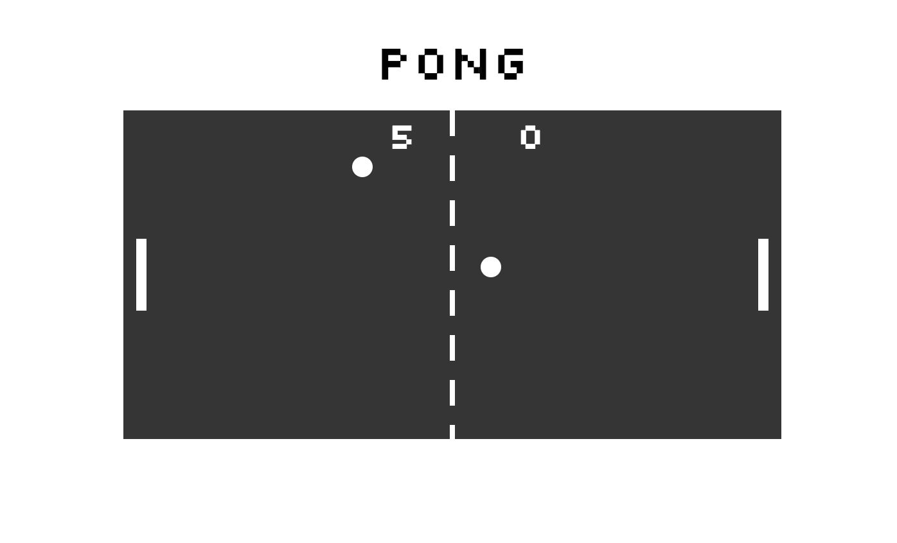

# Pong Game

A basic pong game using SVGs.

## Setup

**Install:**

`> npm i`

**Run:**

`> npm start`

## Keys

**Player 1:**
* a: up
* z: down

**Player 2:**
* ▲ : up
* ▼: down

**Pause:**
* spacebar: pause game

## Technology Used
* ATOM Text editor
* HTML5 Audio sounds triggered on ball bounces
* SVGs to render the pong game
* ES2015
* Webpack as a build tool
